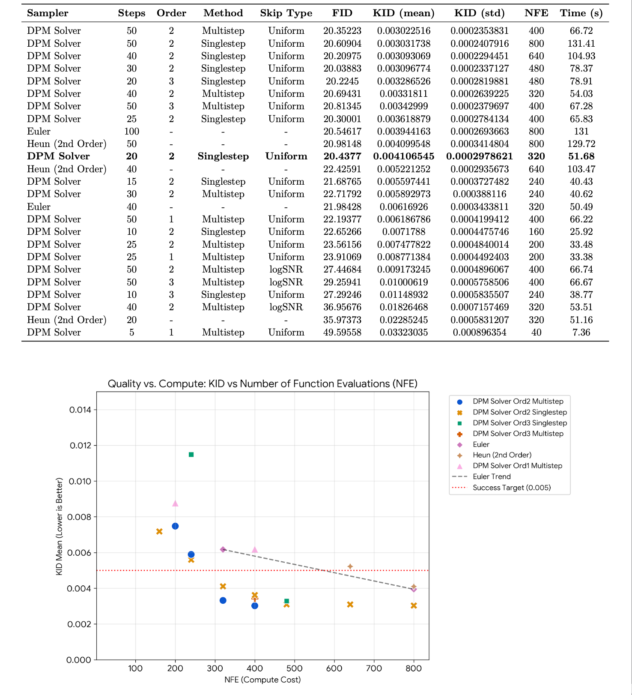

# CMU 10799: Diffusion & Flow Matching Homework Compendium

Welcome to CMU 10799 Spring 2026: Diffusion & Flow Matching homework taught by Yutong (Kelly) He !

This repository contains the code for all four homework assignments done by me, Gautam Diwan. Here, I built a working diffusion model from scratch, starting with DDPM fundamentals and progressing through DDIM, flow matching to my chosen specialization track: Speed

[Class Website](https://kellyyutonghe.github.io/10799S26/) | [Homework Handouts](https://kellyyutonghe.github.io/10799S26/homework/)

#### HW4 Poster Snapshot


## End-to-End Project Arc (HW1 -> HW4)

This repository now contains the full progression of my CMU 10-799 project, not just the final homework.

### HW1: DDPM Foundations

- Implemented DDPM end-to-end (`ddpm.py`, `unet.py`, training/sampling/eval pipeline).
- Established the first quality baseline on CelebA-64 with KID below the course threshold.
- Built intuition around timestep effects, parameterization, and sampling-cost tradeoffs.

### HW2: Flow Matching + DDIM

- Implemented Flow Matching (`flow_matching.py`) and DDIM sampling on top of DDPM.
- Found that Flow Matching achieved stronger speed-quality tradeoff than DDIM at low step budgets.
- Finalized the **Speed** track direction for HW3/HW4.

### HW3: Solver-Centric Speed Baseline (No Retraining)

- Focused on ODE solver improvements over a fixed Flow Matching checkpoint.
- Implemented and benchmarked Euler / Heun / DPM-Solver with order, step, and schedule ablations.
- Key baseline from this stage: **DPM-Solver-2, singlestep, 20 steps, uniform schedule** (KID ~0.0041, NFE 320).

#### HW3 Solver Sweep Summary



### HW4 (Highlight): Distillation + Systems Co-Design

- Shifted from solver-only acceleration to training-based acceleration:
  - Progressive Distillation: `20->10`, then `10->5`
  - Huber loss + anchor stabilization (+ optional feature-level matching)
  - L40S optimizations: mixed precision, TF32, channels-last, `torch.compile`
- Also tested compact student architecture for faster inference.

#### Representative Final Results (1000 samples)

| Model Variant | Steps | FID | KID Mean | KID Std | NFE | Time |
|---|---:|---:|---:|---:|---:|---:|
| HW3 baseline: DPM-Solver-2 (uniform, singlestep) | 20 | 20.4377 | 0.004106545 | 0.0002978621 | 320 | 51.68s |
| MeanFlow (20 steps) | 20 | 40.84455 | 0.02728433 | 0.0008754781 | 80 | 25.27s |
| Progressive Distillation (20->10, 40k) | 10 | 26.34567 | 0.009454842 | 0.0004839942 | 80 | 25.82s |
| Progressive Distillation (20->10, 80k) | 10 | 22.60712 | 0.007012112 | 0.0003206713 | 80 | 25.87s |
| Progressive Distillation (10->5 compact, 60k) | 5 | 28.40876 | 0.01047601 | 0.0005119737 | 40 | 6.47s |

Interpretation:
- Distillation gives major speedup (NFE/time).
- Longer training improves 10-step quality (40k -> 80k).
- At very low steps, quality remains limited by trajectory geometry + model capacity.

### HW4-Specific Additions in This Repo

- New method: `src/methods/progressive_distillation.py`
- Distillation configs:
  - `configs/progressive_distillation_20_to_10.yaml`
  - `configs/progressive_distillation_10_to_5.yaml`
- Training/sampling compatibility updates:
  - `train.py` (student model overrides, compile/channels-last support, PD integration)
  - `sample.py` (correct model reconstruction for distilled checkpoints)

### Reproduce Key HW4 Runs

```bash
# Stage A: 20 -> 10 distillation
python train.py --method progressive_distillation --config configs/progressive_distillation_20_to_10.yaml

# Stage B: 10 -> 5 distillation (compact student)
python train.py --method progressive_distillation --config configs/progressive_distillation_10_to_5.yaml
```

```bash
# Sample/evaluate distilled model
python sample.py \
  --checkpoint logs/<run>/checkpoints/progressive_distillation_final.pt \
  --method progressive_distillation \
  --config logs/<run>/config.yaml \
  --num-steps 10

./scripts/evaluate_torch_fidelity.sh \
  --checkpoint logs/<run>/checkpoints/progressive_distillation_final.pt \
  --method progressive_distillation \
  --num-steps 10 \
  --num-samples 1000 \
  --metrics kid,fid \
  --dataset-path data/celeba-subset/train/images
```

## Project Structure

```
cmu-10799-diffusion/
├── train.py                  # Training script
├── sample.py                 # Sampling script
├── download_dataset.py       # Download CelebA dataset
├── modal_app.py              # Modal cloud setup
├── setup.sh                  # Setup script (pip + venv)
├── setup-uv.sh               # Setup script (uv - faster!)
├── pyproject.toml            # Python package configuration
│
├── src/                      # Source code
│   ├── models/
│   │   ├── blocks.py         # U-Net components (ResBlock, Attention, etc.)
│   │   └── unet.py           # Complete U-Net architecture
│   ├── methods/
│   │   ├── base.py           # Base method class
│   │   └── ddpm.py           # DDPM implementation
│   ├── data/
│   │   └── celeba.py         # CelebA dataset loading, TODO: fill in your data transforms functions
│   └── utils/
│       ├── ema.py            # EMA helper
│       └── logging_utils.py  # Logging utilities
│
├── configs/                  # Hyperparameter configurations
│   ├── ddpm_modal.yaml       # DDPM config for Modal
│   └── ddpm_babel.yaml       # DDPM config for Babel cluster
│
├── scripts/                  # Shell scripts for Modal/cluster
│   ├── train.sh              # SLURM job template (tested on babel)
│   ├── evaluate_torch_fidelity.sh        # torch-fidelity evaluation on cluster or locally (tested on babel)
│   ├── evaluate_modal_torch_fidelity.sh  # torch-fidelity evaluation on Modal
│   └── list_checkpoints.sh   # List Modal checkpoints
│
├── notebooks/                # Jupyter notebooks
│   ├── 01_1d_playground.ipynb
│   ├── 02_dataset_exploration.ipynb
│   └── 03_sampling_visualization.ipynb
│
├── environments/             # Environment configurations
│   ├── requirements.txt      # Base dependencies
│   ├── requirements-cpu.txt  # CPU-only PyTorch
│   ├── requirements-cuda*.txt  # PyTorch + CUDA versions
│   └── requirements-rocm.txt # PyTorch + ROCm (AMD)
│
└── docs/                     # Documentation
    ├── SETUP.md              # Platform-specific setup guide
    ├── QUICKSTART-MODAL.md   # Quick start for Modal users
    └── DIRECTORY-STRUCTURE.md # Directory structure guide
```

## List of TODOs

1. src/data/celeba.py: fill in your data transforms functions
2. src/methods/ddpm.py: implement everything in this file
3. src/models/unet.py: implement the unet model architecture and its forward pass
4. configs/: create your own model configs
5. train.py: incorporate your sampling scheme to the training pipeline and save generated samples as images for logging
6. sample.py: incorporate your sampling scheme to the training pipeline and save generated samples as images

## Example scripts & Helper skeleton notebooks
Besides the parts that you need to implement, the starter code also provides several example scripts & helper notebook skeleton to help you get started.

The scripts are stored in scripts/ and the notebooks are stored in notebooks/. Feel free to use (or not use), add, delete or modify any and all parts of these scripts and notebooks.

## Quick Start

### 1. Setup Environment

```bash
git clone <repo-url>
cd cmu-10799-diffusion

# Run setup script (auto-detects your GPU)
./setup-uv.sh                 # Using uv (faster)
# or
./setup.sh                    # Using standard pip

# Activate the environment (name depends on detected hardware)
source .venv-cpu/bin/activate        # If CPU was detected
source .venv-cuda121/bin/activate    # If CUDA 12.1 was detected
```

### 2. Download Dataset

```bash
python download_dataset.py
```

### 3. Train (SLURM Cluster)

```bash
# Train DDPM (uses configs/ddpm.yaml by default)
sbatch scripts/train.sh ddpm

# Train with custom config
sbatch scripts/train.sh ddpm configs/ddpm_babel.yaml

# Resume from checkpoint
sbatch scripts/train.sh ddpm --resume checkpoints/ddpm_50000.pt
```

### 4. Train (Modal Cloud GPU)

For students without a local GPU:

```bash
# First time: cache dataset to Modal volume
modal run modal_app.py --action download

# Train DDPM
modal run modal_app.py --action train --method ddpm
```

See [docs/QUICKSTART-MODAL.md](docs/QUICKSTART-MODAL.md) for complete Modal setup.

### 5. Evaluate

```bash
# Evaluate using torch-fidelity (local/cluster)
./scripts/evaluate_torch_fidelity.sh ddpm checkpoints/ddpm/ddpm_final.pt

# Evaluate on Modal
./scripts/evaluate_modal_torch_fidelity.sh ddpm checkpoints/ddpm/ddpm_final.pt
```

### Jupyter Notebooks

- `01_1d_playground.ipynb` - 1D diffusion experiments for building intuition
- `02_dataset_exploration.ipynb` - Explore CelebA dataset
- `03_sampling_visualization.ipynb` - Visualize your samples

---

## Manual Installation

If the setup scripts don't work for your system, you can set up manually.

### Option A: Manual setup with uv

[uv](https://github.com/astral-sh/uv) is a fast Python package manager (10-100x faster than pip).

```bash
# 1. Install uv (one-time)
curl -LsSf https://astral.sh/uv/install.sh | sh   # macOS/Linux
# or: pip install uv

# 2. Clone and enter repo
git clone <repo-url>
cd cmu-10799-diffusion

# 3. Create virtual environment
uv venv .venv-cpu              # For CPU
uv venv .venv-cuda121          # For CUDA 12.1

# 4. Activate it
source .venv-cpu/bin/activate        # CPU
source .venv-cuda121/bin/activate    # GPU

# 5. Install dependencies (choose one)
uv pip install -r environments/requirements-cpu.txt      # No GPU / Modal users
uv pip install -r environments/requirements-cuda121.txt  # NVIDIA GPU (most common)

# 6. Verify
python -c "import torch; print(f'PyTorch {torch.__version__}, CUDA: {torch.cuda.is_available()}')"
```

### Option B: Manual setup with pip + venv

Check your CUDA version: `nvidia-smi` (top right shows "CUDA Version: XX.X")

```bash
# 1. Clone and enter repo
git clone <repo-url>
cd cmu-10799-diffusion

# 2. Create virtual environment
python -m venv .venv-cpu        # For CPU
python -m venv .venv-cuda121    # For CUDA 12.1

# 3. Activate it
source .venv-cpu/bin/activate        # CPU
source .venv-cuda121/bin/activate    # GPU

# 4. Install dependencies (choose one)
pip install -r environments/requirements-cpu.txt      # No GPU / Modal users
pip install -r environments/requirements-cuda121.txt  # NVIDIA GPU (most common)

# 5. Verify
python -c "import torch; print(f'PyTorch {torch.__version__}, CUDA: {torch.cuda.is_available()}')"
```

See [docs/SETUP.md](docs/SETUP.md) for detailed instructions for Modal, AWS, and SLURM clusters.

---

## Running Customized Commands Manually

If you prefer to run Python commands directly instead of using the provided scripts:

### Training

```bash
python train.py --method ddpm --config configs/ddpm.yaml
```

### Generating Samples

```bash
python sample.py --checkpoint checkpoints/ddpm_final.pt --method ddpm --num_samples 64

# With custom number of sampling steps
python sample.py --checkpoint checkpoints/ddpm_final.pt --method ddpm --num_steps 500
```

### Evaluation

Use the provided shell scripts that wrap `torch-fidelity`:

```bash
# Evaluate locally or on cluster
./scripts/evaluate_torch_fidelity.sh ddpm checkpoints/ddpm_final.pt

# Evaluate on Modal
./scripts/evaluate_modal_torch_fidelity.sh ddpm checkpoints/ddpm_final.pt
```

### Modal (Advanced Options)

```bash
# Train with custom config
modal run modal_app.py --action train --method ddpm --config configs/custom.yaml

# Train with custom iterations
modal run modal_app.py --action train --method ddpm --iterations 50000
```

To enable Weights & Biases logging on Modal:
```bash
modal secret create wandb-api-key WANDB_API_KEY=your_real_key
```

## Configuration

All hyperparameters are controlled via config files. Edit `configs/ddpm*.yaml` to configurate your model.

---


## Authors

Gautam Diwan: Completed HW1-HW4
Yutong (Kelly) He: Course Instructor; provided starter code with assistance from Claude Code and OpenAI Codex.

## References

- [DDIM official code](https://github.com/ermongroup/ddim/)
